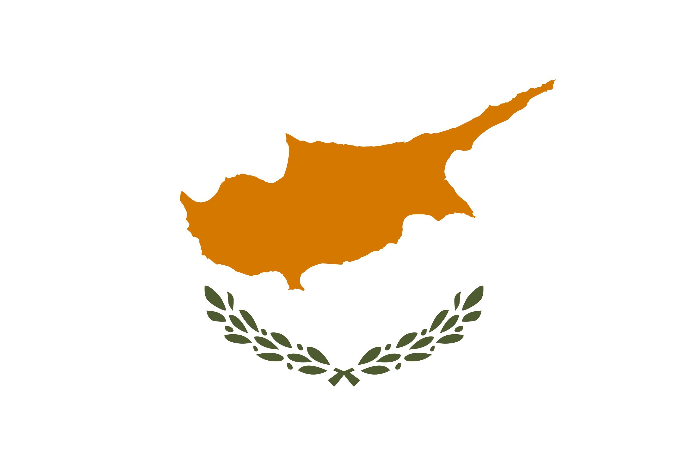

# \# [WIP] Кипр – релокация в 2022

Сказ о том, как на самом деле живется айтишникам на всем известном греческом острове. Если ты когда-нибудь задумывался 
о переезде на Кипр или прямо сейчас впопыхах собираешь шмотки, чтобы покинуть свою страну, то эта статья для тебя!

[overview]: <>
## Содержание

1. [Преамбула](#preambula)
2. [Подготовка к переезду](#get-ready)
3. [Про людей](#people)
4. [Про еду](#food)
5. [Про жилье](#estate)
6. [Про авто](#auto)
7. [Вместо заключения](#end)

## \#\# Преамбула

Хочется начать с того, что сам я вообще никогда особо и не задумывался о переезде из России. Быть айтишником у нас, 
знаете ли, привилегия – делаешь любимую работу, тебе платят за это дохуя денег, а на случай выгорания у тебя всегда есть
возможность взять отпуск или пойти на linked.in с забитой рекрутерами личкой. 

Есть только одна маленькая проблема, которую не решишь ни офисными плюшками, ни отпусками, ни деньгами – в любой момент времени
может начаться какой-то неотвратимый пиздец. Война, изоляция от внешнего мира, инфляция, какой-то ебанутый курс валют – здравствуйте!
И только попробуй пытаться идти поперек внешней политики – местные орки Васи с огромным удовольствием раздадут тебе пиздюлей за любое
проявление инакомыслия.

    <a href="https://www.mk.ru/incident/2022/03/18/zhitelya-krasnodara-zaderzhali-za-plevok-v-plakat-s-bukvoy-z.html" style="display:inline-block">Источник</a>

  

Все это послужило сильным пинком к тому, чтобы принять решение – валить, как можно скорее уезжать, пока границы не закрыли, а
айтишников не посадили в клетку, чтобы те писали очередной государственный говнософт. Утрирую, конечно, хотя кто знает,
что случится завтра?

## \#\# Подготовка к переезду

Включает в себя несколько проблем, которые ты обязательно должен решить за относительно небольшие сроки:

1. Наличная валюта
2. Оформление виз
3. Покупка билетов

### \#\#\# Про валюту

Обязательно позаботься о том, чтобы вывезти с собой достаточное количество. Под "достаточным" я имею
в виду столько, сколько это в принципе возможно по закону – до **10000 USD**. 

Здесь у тебя есть несколько вариантов:

1. Купить на бирже и перевести на работающую за границей карту (_UnionPay_)
2. Купить наличку у банков (спред **20-40%** от биржевого)
3. Cryptoshit

#### \#\#\#\# UnionPay

Кто бы мог подумать, что эта до сих пор никому не известная китайская залупа, работающая _примерно нигде_, вдруг сможет
кому-нибудь пригодиться. 

Добро пожаловать в прекрасный мир комиссий: только за оформление UnionPay-карты, которую в любой момент могут заблокировать, 
банк возьмет с тебя **10000 ₽** комиссии, затем – за каждый SWIFT-перевод (комиссии и ограничения на свифты тоже меняются и 
растут с каждым днем) будь добр отдать от **1%**, а затем – за снятие в банкомате – не более **2000 €** за раз – **1%** + **4 €**.
Круто!

На самом деле, эта карта меня спасла – я чуть ли не в последний момент успел перечислить на нее, а также вывести в кеш на Кипре все деньги,
которые оставались у меня в рублях. Я оформлял РоссельхозБанк (он уже заблокирован), многие люди открывали UnionPay в
[Солидарности](https://solid.ru/retail/cards/debit/unionpay-gold-solidarnost/) – он пока работает.

Кстати, насчет этих карт есть довольно полезный telegram-канал [UnionPay в России](https://t.me/unionpayru).

#### \#\#\#\# Наличка в банках

Самый надежный, но далеко не самый лучший способ – будь готов отдать банку **80-90 ₽** за **1 €** (при биржевом курсе в **56 ₽**),
а также надейся, что наличка в отделении вообще будет. Если вдруг решишься, обязательно сохрани у себя квитанцию
об обмене валюты – она может пригодиться в дальнейшем.

#### \#\#\#\# Крипта

Оказывается, на Кипре есть люди, которые готовы поменять твои **USDT** на наличные евро с доставкой на дом.
Здесь нужно быть осторожным – высокая вероятность встретить мошенников. Курсы тоже не то чтобы прямо супер-выгодные, но
для довольно больших сумм пойдет. Про этот способ я узнал довольно поздно из [этого](https://t.me/cyexchange) телеграм-чатика.

### \#\#\# Про визы

В общем случае для поездки на Кипр у тебя есть три варианта:

1. [Национальная виза Кипра](http://www.mfa.gov.cy/mfa/consulate/consulate_spb.nsf/cgsp12_ru/cgsp12_ru?OpenDocument)
2. [Болгарская виза](https://www.vfsglobal.com/Bulgaria/Russia/Moscow/pdf/Private-Visit.pdf)
3. Шенген

#### \#\#\#\# Национальная виза

Выдается на три месяца – полгода. Находясь в РФ, можно получить в консульствах Кипра: в Краснодаре, Спб, Москве, Самаре 
и Екатеринбурге. Список документов на подачу простой, но есть один нюанс, из-за которого мы с девушкой не стали ее оформлять –
при подаче на Национальную визу требуется приложить оплаченные билеты в **обратную** сторону, 
а также подтвержденные и **оплаченные** ваучеры на проживание. Очень не хотелось разбираться с отменой билетов, 
а также заморачиваться с поиском отелей под наши даты (тем более, что ру-картами ты больше ничего оплатить не сможешь),
поэтому эта виза для нас не подошла.

#### \#\#\#\# Болгарская виза

Самая простая в получении – по сути она тоже требует наличие отелей и обратных билетов, но именно для этого типа визы можно обратиться в агенство,
которое сделает все за тебя – отдаешь им загран и платишь бабки, а через неделю уже можешь забирать свою визу. 
Выдается на год, по ней ты можешь в течение **90** дней находиться на Кипре, в Болгарии, Хорватии и Румынии.
Цена вопроса – **от 5 до 15 тысяч** за одну визу.

#### \#\#\#\# Шенген

Тут особо ничего сказать не могу. Выдают ее на **90** – **180** дней.

### \#\#\# Билеты и перелет

Здесь самая сложная часть – не сдохнуть в перерывах между огромным количеством пересадок на пути в заветную Ларнаку.

А, и, кстати, следи за ограничениями по весу на багаж и ручную кладь – в составном маршруте они могут отличаться,
из-за чего тебе придется постоянно изъебываться с тем, чтобы по-нормальному сложить вещи.

Что касается валюты и таможенного контроля – никто не просил меня показать наличку и пересчитывать ее на камеру.
Единственное – в Сочи спросили, сколько денег я с собой везу, и просто поверили мне на слово. 
На таможне никто не проверял мой телефон и даже не спрашивали, чем я занимаюсь, так что этот этап оказался не таким страшным.

Мы летели маршрутом **Сочи** – **Ереван** – **Афины** – **Ларнака** – по нему у тебя меньше всего всяких ковидных ограничений, 
а длительная пересадка в Армении позволяет без каких-либо проблем выйти в город по российскому паспорту и переночевать
в каком-нибудь отеле. 

К слову, Армения – заебись! Здесь вкусная еда и недорогие сервисы. К сожалению, мы были очень уставшие и провели в
Ереване всего несколько часов до следующей пересадки, поэтому больше ничего особо сказать не могу.

Следующий пункт назначения – Афины. Там у нас был всего **1 час** на пересадку, и мы сильно переживали, что его не хватит.
Однако, все прошло без каких-либо проблем – сонные и измученные мы в очередной раз прошли таможенный контроль и отправились
через транзит на самолет. 

По прилете на Кипр тебе обязательно нужно будет сделать две вещи: задекларировать наличную валюту, которую ты с собой привез –
это может пригодиться при открытии счета в местных банках (если их можно так назвать), а также купить местную симку –
они временные и продаются без паспорта, платишь **5 - 20 €**, и месяц можешь пользоваться местным номером.

Кстати, про декларацию – я боялся декларировать больше **10000 €**, но оказалось, что на Кипре всем пофиг, сколько ты привез,
главное – суметь объяснить, откуда у тебя такие деньхи.

## \#\# Про людей

Люди – это первое, на что ты начинаешь обращать внимание по приезде в другую страну. И я хочу сказать, что люди здесь –
норм! Наконец-то все улыбаются, наконец-то тебе желают хорошего дня и всегда здороваются в ответ. Это очень
непривычно после России. Помню, как расплачиваясь в "Ашане" мне вздумалось пожелать кассирше хорошего дня, –
так она просто промолчала и скосила брови, будто я какой-то чудик.

Мудаки здесь, конечно же, есть, но средняя по больнице все равно гораздо ниже, чем в Москве или, тем более, в регионах
России.

Местные аборигены живут спокойной и размеренной жизнью – 

TODO
